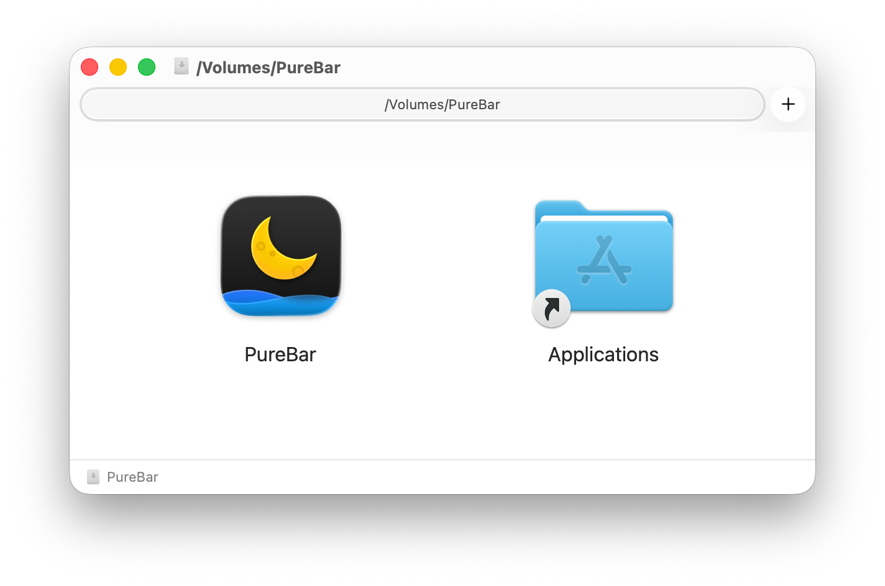

# PureBar

[](https://github.com/tbxhs/PureBar/releases/latest) [](https://github.com/tbxhs/PureBar/actions/workflows/build-and-test.yml) [](https://github.com/tbxhs/PureBar/releases/latest) [](./LICENSE)

**纯粹、简洁、高效** — 完全免费且开源的 macOS 菜单栏日历应用

支持农历、公共假日、系统日历集成、提醒事项等功能，为你的 Mac 菜单栏带来优雅的日历体验。

 

---

## ✨ 功能特性

- 📅 **农历与公历** - 同时显示农历和公历日期
- 🎊 **公共假日** - 内置中国大陆、香港、台湾等地假日
- 📆 **日历集成** - 无缝显示系统日历事件和提醒事项
- 🎨 **图标自定义** - 支持多种菜单栏图标样式（日期、日历、系统符号、自定义格式）
- 🌓 **外观适配** - 跟随系统、浅色或深色模式
- ⚡️ **轻量简洁** - 极简设计，专注核心功能
- 🔒 **隐私安全** - 完全本地运行，无数据收集
- 🔄 **自动更新** - 基于 Sparkle 的安全更新系统

---

## 📦 安装 PureBar

### 安装方式

从 [**最新版本**](https://github.com/tbxhs/PureBar/releases/latest) 页面下载 `PureBar.dmg`，打开后将 `PureBar.app` 拖拽至 `Applications` 文件夹即可。



### 系统要求

- **操作系统**: macOS 15.0 (Sequoia) 或更高版本
- **架构**: Apple Silicon (M1/M2/M3/M4) 或 Intel 芯片

> [!NOTE]
> PureBar 是**沙盒应用**，经过**代码签名**和 [**公证**](https://developer.apple.com/documentation/security/notarizing_macos_software_before_distribution) 认证，可安全使用。
>
> **兼容旧版 macOS 的历史版本**：
> - [macOS 13 (Ventura)](https://github.com/tbxhs/PureBar/releases/tag/macos-13)
> - [macOS 14 (Sonoma)](https://github.com/tbxhs/PureBar/releases/tag/macos-14)

---

## 👨‍💻 构建项目

如果你是开发者，想要从源代码构建 PureBar：

**要求**: Xcode 16.0+ 和 macOS 15.0+

1. 克隆仓库并打开项目：
   ```bash
   git clone https://github.com/tbxhs/PureBar.git
   cd PureBar
   open PureBar.xcodeproj
   ```

2. 选择 `PureBarMac` scheme，按 `⌘R` 运行

> [!TIP]
> Xcode 会自动通过 Swift Package Manager 下载依赖（Sparkle），无需额外配置。

---

## 💡 为什么选择 PureBar

如果你符合以下任一条件，PureBar 可能正适合你：

- ✅ 日常使用 macOS
- ✅ 需要快速查看农历日期
- ✅ 需要查看中国大陆/港澳台公共假日
- ✅ 希望在菜单栏集成系统日历
- ✅ 喜欢极简、无干扰的应用设计
- ✅ 重视开源和隐私安全

### 设计理念

PureBar 的极简设计是**经过深思熟虑的结果**。我们相信：

- **专注核心功能** - 不做臃肿的"全能"日历
- **尊重系统设计** - 与 macOS 原生体验无缝融合
- **纯粹的工具** - 无广告、无追踪、无账号系统

> [!IMPORTANT]
> 如果 PureBar 不能满足你的需求，我们建议尝试其他优秀的日历应用，而不是期待我们添加过多功能。

---

## 📄 许可证

本项目基于 [MIT 许可证](./LICENSE) 开源。

---

## 🙏 致谢

感谢 [Sparkle](https://sparkle-project.org/) 提供优秀的 macOS 自动更新框架。

---

<p align="center">
  Made with ❤️ by PureBar Team
  <br>
  <a href="https://github.com/tbxhs/PureBar/stargazers">⭐️ Star</a> this repo if you find it useful!
</p>
